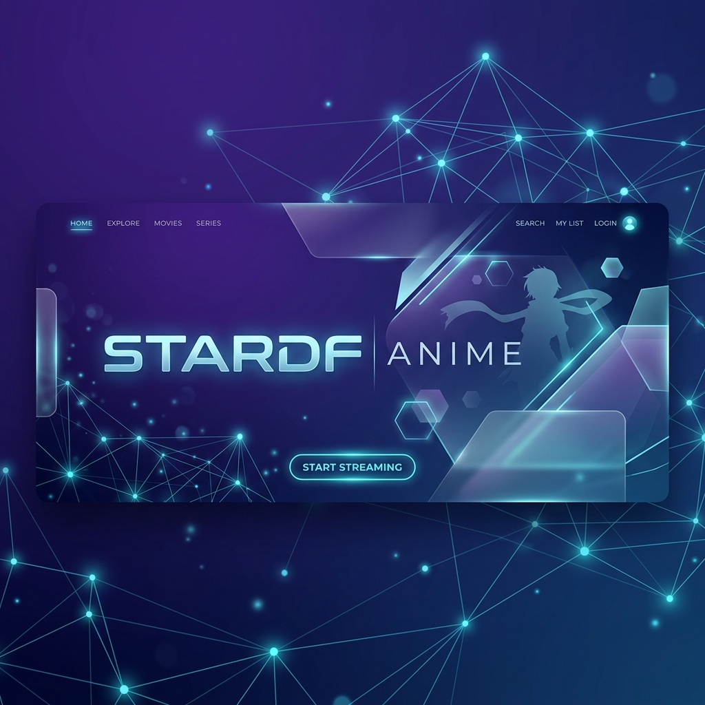

  

  
  

# StarDF-Anime Downloads

This repository is the public distribution channel for **StarDF-Anime**.

It contains only release assets, checksums, and download instructions.

## Latest Release

Open the latest release page:

<https://github.com/charlesnobrega/STARDF-Anime/releases/latest>

## Available Assets

- Windows installer
- Windows portable binary
- Linux builds
- Android APK
- Release checksums

## Verification

Each release may include SHA256 and SHA512 checksum files. Verify downloads before installation when checksum files are present.

## Notes

- This repository is intended for end-user downloads.
- Release assets are published here so public downloads remain available.
