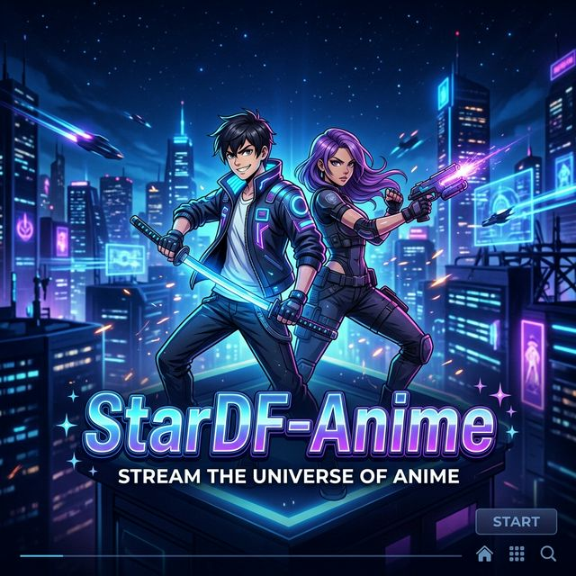

<h4 align="center">
    <p>
        <b>Рortuguês</b> |
        <a href="https://github.com/charlesnobrega/STARDF-Anime/blob/main/README.md">English</a>
    </p>
</h4>

<p align="center">
  
</p>

[](https://github.com/charlesnobrega/STARDF-Anime/blob/main/LICENSE)


[](https://github.com/charlesnobrega/STARDF-Anime/actions)


# StarDF-Anime

StarDF-Anime é uma interface de terminal (TUI) poderosa para navegar, assistir e acompanhar seus animes e filmes. Conta com sincronização em tempo real com o AniList, busca de alta performance e metadados enriquecidos para conteúdos em português e inglês.

### Versão Mobile (Em breve)

Uma versão mobile do StarDF-Anime está planejada para dispositivos Android.

### Comunidade

Entre na nossa comunidade oficial para suporte, atualizações e feedbacks:
[](https://discord.gg/stardf-anime)

## Recursos

- **NOVO:** Interface Web Premium (no mesmo binário da CLI, via `-web`)
- **NOVO:** Suporte a Filmes e Séries via FlixHQ
- **NOVO:** Integração OMDb para metadados de filmes/séries
- **NOVO:** Rastreamento SQLite Universal (100% Go, sem CGO)

> **Nota:** O StarDF-Anime agora utiliza uma implementação SQLite em puro Go. Todos os binários oficiais de lançamento incluem suporte total a histórico e rastreamento por padrão, sem dependências externas de CGO.

# Demonstração Web UI


## Pré-requisitos

- Go (na versão mais recente)
- Mpv (na versão mais recente)

## Como instalar e executar

### Instalação Universal (Só precisa do Go instalado)

```shell
go install github.com/charlesnobrega/STARDF-Anime/cmd/stardf-anime@latest
```

### Métodos de instalação manual

```shell
git clone https://github.com/charlesnobrega/STARDF-Anime.git
```

```shell
cd STARDF-Anime
```

```shell
go run cmd/stardf-anime/main.go
```

## Filmes e Séries

StarDF-Anime agora suporta filmes e séries através da fonte FlixHQ. 

### Como usar:
- Use a flag `--source flixhq` para buscar filmes e séries.
- Você também pode filtrar por tipo usando o parâmetro `--type` (ex: `--type movie` para filmes ou `--type tv` para séries).

```bash
# Buscar filmes/séries
stardf-anime --source flixhq "The Matrix"

# Buscar somente filmes
stardf-anime --source flixhq --type movie "Inception"

# Buscar somente séries
stardf-anime --source flixhq --type tv "Breaking Bad"

# Habilitar legendas (inglês por padrão)
stardf-anime --source flixhq --subs "Avatar"
```


## Linux

<details>
<summary>Arch Linux / Manjaro (sistemas baseados em AUR)</summary>

Usando Yay:

```bash
yay -S stardf-anime
```

ou usando Paru:

```bash
paru -S stardf-anime
```

Ou, para clonar e instalar manualmente:

```bash
git clone https://aur.archlinux.org/stardf-anime.git
cd stardf-anime
makepkg -si
sudo pacman -S mpv
```

</details>

<details>
<summary>Debian / Ubuntu (e derivados)</summary>

```bash
sudo apt update
sudo apt install mpv

# Para sistemas x86_64:
# curl -Lo stardf-anime https://github.com/charlesnobrega/STARDF-Anime/releases/latest/download/stardf-anime-linux
```

</details>

<details>
<summary>Instalação no Fedora</summary>

```bash
sudo dnf update
sudo dnf install mpv

# Para sistemas x86_64:
# curl -Lo stardf-anime https://github.com/charlesnobrega/STARDF-Anime/releases/latest/download/stardf-anime-linux
```

</details>

<details>
<summary>Instalação no openSUSE</summary>

```bash
sudo zypper refresh
sudo zypper install mpv

# Para sistemas x86_64 (Em breve):
# curl -Lo stardf-anime https://github.com/charlesnobrega/STARDF-Anime/releases/latest/download/stardf-anime-linux
```

</details>

## Windows

<details>
<summary>Instalação no Windows</summary>

> **Altamente Recomendado:** Use o instalador para a melhor experiência no Windows.

Opção 1: Executável Windows (binário único: CLI + Web UI)

- Baixe o `stardf-anime-windows.zip` mais recente na seção de [releases](https://github.com/charlesnobrega/STARDF-Anime/releases).
- Extraia e execute `stardf-anime.exe`.
- Use `stardf-anime.exe -web` para iniciar a Web UI Premium com um clique.

Opção 2: Instalador Inno Setup

- Um instalador completo está disponível para facilitar a integração com o PATH e criar atalhos com ícone automaticamente.
- Ele cria atalhos no Menu Iniciar para `StarDF-Anime (Console)` e `StarDF-Anime (Web UI)`.

</details>

## macOS

<details>
<summary>Instalação no macOS</summary>

Primeiro, instale o mpv usando o Homebrew:

```bash
# Instale o Homebrew se você ainda não tiver
/bin/bash -c "$(curl -fsSL https://raw.githubusercontent.com/Homebrew/install/HEAD/install.sh)"

# Instale o mpv
brew install mpv

# Baixe e instale o stardf-anime
# curl -Lo stardf-anime https://github.com/charlesnobrega/STARDF-Anime/releases/latest/download/stardf-anime-apple-darwin
```

Instalação alternativa usando MacPorts:

```bash
# Instale o mpv usando MacPorts
sudo port install mpv

# Baixe e instale o StarDF-Anime (Em breve)
# curl -Lo stardf-anime https://github.com/charlesnobrega/STARDF-Anime/releases/latest/download/stardf-anime-apple-darwin
```

</details>

### Uso

Para iniciar a aplicação, basta executar:

```bash
stardf-anime
```

### Uso Avançado

Você pode buscar e reproduzir conteúdos diretamente pela linha de comando:

- Buscar e reproduzir:
```bash
stardf-anime "One Piece"
```

- Atualizar para a versão mais recente:
```bash
stardf-anime --update
```

- Ajuda e opções:
```bash
stardf-anime --help
```

O programa oferece uma TUI totalmente interativa. Você pode navegar pelos resultados, telas de seleção e controles de reprodução usando seu teclado.

