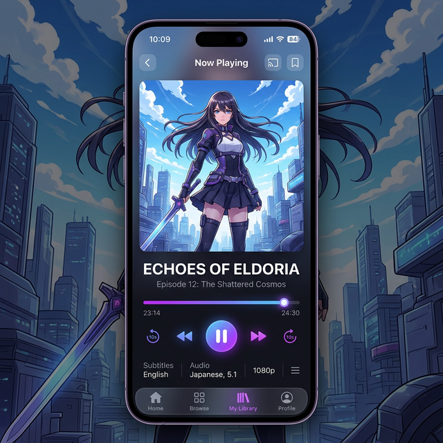

# StarDF-Anime Mobile

The mobile version of StarDF-Anime is currently under development. This project aims to bring the powerful terminal experience of StarDF to Android devices, providing a seamless way to browse, stream, and track anime on the go.

## Tech Stack (Planned)

- **Framework**: Flutter (for cross-platform compatibility and high performance)
- **Core Logic**: Reusing `pkg/stardf` via GoMobile or a bridge
- **Tracking**: Synced with the same SQLite database or AniList
- **Player**: Integration with native players (VLC/MPV)

## Status

- [ ] Project Initialization
- [ ] UI/UX Design Mockups
- [ ] Core Library Integration
- [ ] Alpha Release

## Mockups

